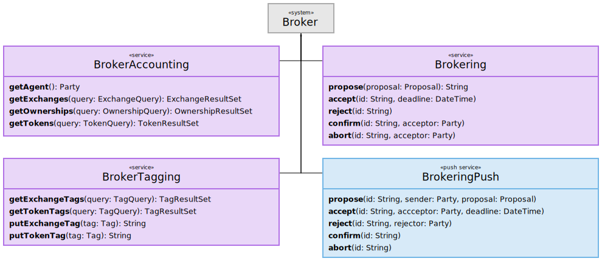
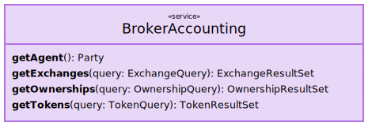
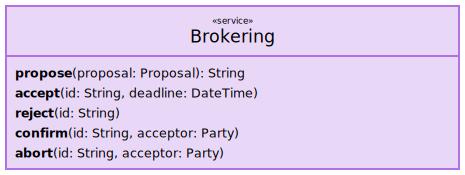
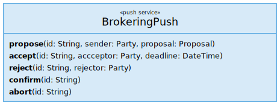
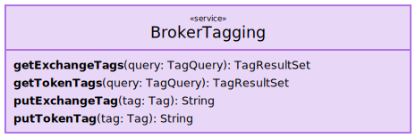

# The Arrowhead Broker – Service Description

## Abstract

## 1. Overview

The `Broker` system, illustrated below, facilitates token ownership negotitation, accounting, and tagging.
It acts as a trusted intermediary, allowing its consumers to access an arbitrary _trading platform_, which allows them to exchange `Token`s representing arbitrary value.

## 1.1. Brokering Sessions

Whenever a properly authorized Arrowhead system consumes the `Brokering` service produced by a `Broker` system, a session is created or resumed. The session is associated with the certificate of the consuming service, and stores its _trading platform identity_, as well as information about any on-going `Token` exchanges. The _trading platform identity_ of a consuming service can be queried via the `BrokerAccounting` service `getAgent` function.

## 2. Service Interfaces

### 2.1. BrokerAccounting

The `BrokerAccounting` service, depicted below, accounts for past exchange events as well as the identity it uses to represent its consumer.
The services provides no sophisticated analytical capabilities; it serves lists of `Exchange`s, `Ownership`s and `Token`s in response to simpler queries.
If data analysis is desired, the service can provide any data required to any properly authorized analysis service.

#### 2.1.1 Functions

__getAgent__ Gets `Party` object used by the Broker system to represent the consuming service calling this function.

__getExchanges__ Queries for any `Exchange` objects the consuming service is allowed to see.

__getOwnerships__ Queries for any `Ownership` objects the consuming service is allowed to see.

__getTokens__ Queries for any `Token` objects the consiming service is allowed to see.

### 2.2. Brokering

The below depicted `Brokering` service is used by consuming service to _send_ messages for creating or updating _Exchange State Machines_ (ESMs).
The service is always used together with the `BrokeringPush` service, which is used for _receiving_ ESM updates made by any exchange counter-parties.

#### 2.2.1. Functions

__propose__ Proposes a `Token` exchange.

__accept__ Accepts a _qualified_ `Proposal`, making it pending confirmation.
If the accepted `Proposal` is not qualified, or if its deadline has expired, the call fails.

__reject__ Rejects a _qualified_ `Proposal`.
If the rejected `Proposal` is not qualified, the call fails.

__confirm__ Confirms an accepted `Proposal`, making it binding.
If the confirmed `Proposal` is not qualified and accepted, the call fails.

__abort__ Aborts accepted exchange `Proposal`.
If the aborted `Proposal` is not qualified and accepted, the call fails.

### 2.3. BrokeringPush

Each service consuming the `Brokering` service must also expose a `BrokeringPush` service in order to receive exchange proposals and updates.
If, however, the corresponding `Brokering` implementation exposes its functions through a chat-like protocol, such as XMPP or JSON-RPC, then this service exists only implicitly.
In that case, the same communication channel established by the `Brokering` consumer is used by the `Brokering` service to send the `BrokeringPush` messages.

#### 2.3.1. Functions

__propose__ Called to notify about an incoming `Token` exchange `Proposal`.

__accept__ Called to notify about a previously sent `Proposal` being accepted.

__reject__ Called to notify about a previously sent `Proposal` being rejected.

__confirm__ Called to notify about a previously accepted `Proposal` being confirmed.

__abort__ Called to notify about a previously accepted `Proposal` being aborted.

### 2.4. BrokerTagging

A service associating `Exchange`s and `Token`s with private metadata.
Tags are _private_ in the sense that they are not made known outside the local cloud of a given Broker.
This means that they cannot be seen or known to exist by parties using the same trading platform via a different Broker in a different cloud.
`Tag`s can be seen, however, by other services allowed to access the `BrokerTagging` service inside the same local cloud.
`Tag`s are suitable for keeping track of plant-specific data, such as internal reference numbers, order identifiers, task assignments, etc.
They should not be used for highly sensitive information, unless measures are taken to protect it through encryption or otherwise.

__getExchangeTags__ Queries for `Exchange` `Tag`s the consuming service is allowed to see.

__getTokenTags__ Queries for `Token` `Tag`s the consuming service is allowed to see.

__putExchangeTag__ Saves given `Exchange` `Tag`, potentially replacing any existing such with the same `tag.id` or `tag.kind` and `tag.subjectId`.

__putTokenTag__ Saves given `Token` `Tag`, potentially replacing any existing such with the same `tag.id` or `tag.kind` and `tag.subjectId`.

## 3. Information Model

See [`model/`](model/).

## References