# The Arrowhead Broker – Service Description

## Abstract

This document describes the services exposed by the Arrowhead Broker System.

## 1. Overview

The `Broker` system, illustrated below, facilitates token ownership negotitation, accounting, and tagging.
It acts as a trusted intermediary, allowing its consumers to access an arbitrary _trading platform_, which allows them to exchange `Token`s representing arbitrary value.

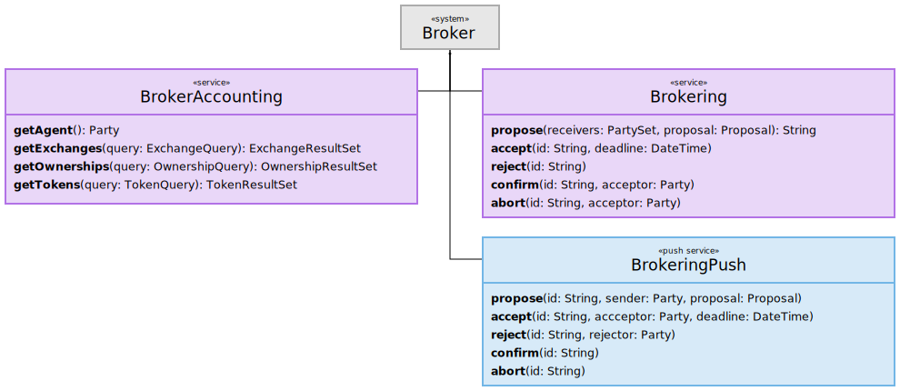

### 1.1. Brokering Sessions

Whenever a properly authorized Arrowhead system consumes the `Brokering` service produced by a `Broker` system, a persistent session is created or resumed.
Each session is associated with the authenticated identity of its owner, provided via a certificate or otherwise.

#### 1.1.1. Trading Platform Indentity

All brokering sessions contain a _trading platform identity_, which is the identity used to represent the session owner while exchanging tokens. The trading platform identity can be queried via the `BrokerAccounting` service `getAgent` function, and is primarily of use to consuming systems for telling their own activity apart from any other data acquired via the `BrokerAccounting` service.

#### 1.1.2. On-Going Token Exchanges

Each session holds all state concerning on-going token exchanges involving its owner, including information about what state notifications the owner has received.
The `Broker` must try to resend `BrokeringPush` messages being lost due to a session owner being unavailable while any proposal in question remains either acceptable or confirmable.

## 2. Service Interfaces

### 2.1. BrokerAccounting

The `BrokerAccounting` service, depicted below, accounts for past exchange events as well as the identity it uses to represent its consumer.
The services provides no sophisticated analytical capabilities; it serves lists of `Exchange`s, `Ownership`s and `Token`s in response to simpler queries.
If data analysis is desired, the service can provide any data required to any properly authorized analysis service.

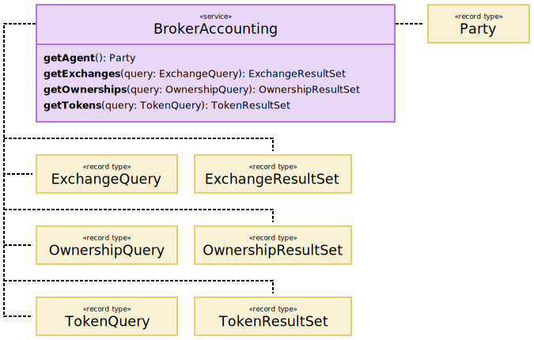

#### 2.1.1 Functions

__getAgent__ Gets `Party` object used by the Broker system to represent the system calling this function.

__getExchanges__ Queries for any `Exchange` objects.

__getOwnerships__ Queries for any `Ownership` objects.

__getTokens__ Queries for any `Token` objects.

### 2.2. Brokering

The below depicted `Brokering` service is used by consuming systems to _send_ messages for creating or updating _Exchange State Machines_ (ESMs).
The service is always used together with the `BrokeringPush` service, which is used for _receiving_ ESM updates made by any exchange counter-parties.

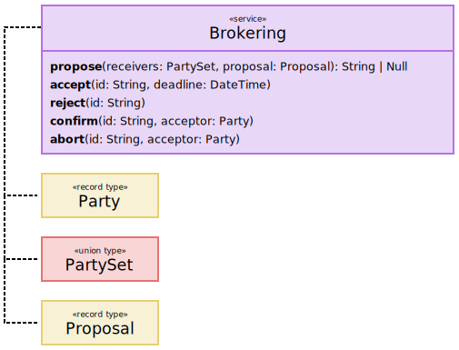

#### 2.2.1. Functions

__propose__ Proposes a `Token` exchange.

__accept__ Accepts a _qualified_ `Proposal`, making it pending confirmation.
If the accepted `Proposal` is not qualified, or if its deadline has expired, the call fails.

__reject__ Rejects a _qualified_ `Proposal`.
If the rejected `Proposal` is not qualified, the call fails.

__confirm__ Confirms an accepted `Proposal`, making it binding.
If the confirmed `Proposal` is not qualified and accepted, the call fails.

__abort__ Aborts accepted exchange `Proposal`.
If the aborted `Proposal` is not qualified and accepted, the call fails.

### 2.3. BrokeringPush

Each system consuming the `Brokering` service must also expose a `BrokeringPush` service in order to receive exchange proposals and updates.
If, however, the corresponding `Brokering` implementation exposes its functions through a chat-like protocol, such as XMPP or JSON-RPC, then this service exists only implicitly.
In that case, the same communication channel established by the `Brokering` consumer is used by the `Brokering` service to send the `BrokeringPush` messages.

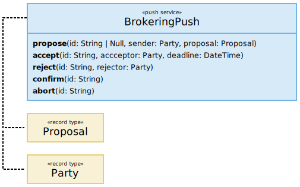

#### 2.3.1. Functions

__propose__ Called to notify about an incoming `Token` exchange `Proposal`.

__accept__ Called to notify about a previously sent `Proposal` being accepted.

__reject__ Called to notify about a previously sent `Proposal` being rejected.

__confirm__ Called to notify about a previously accepted `Proposal` being confirmed.

__abort__ Called to notify about a previously accepted `Proposal` being aborted.

## 3. Information Model

### 3.1. Exchange

Describes a completed `Token` exchange, where a `sender` gave up ownership of
some tokens in `proposal.give`, in exchange for the tokens in `proposal.want`.

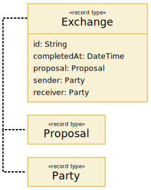

| Field              | Description                                             |
|:-------------------|:--------------------------------------------------------|
| `id`               | UTF-8 string uniquely identifying `Exchange`.           |
| `completedAt`      | The date and time at which `Exchange` was finalized.    |
| `proposal`         | The accepted and confirmed exchange `Proposal`.         |
| `sender`           | `Party` that sent and confirmed `proposal`.             |
| `receiver`         | `Party` that received and accepted `proposal`.          |

### 3.2. ExchangeQuery

A query for `Exchange` items.

__Undefined Implies All__. An `ExchangeQuery` is essentially a set of properties that may or may not be specified in order to limit the size of an `ExchangeResultSet`.
Properties that are not specified ought to be understood as if a certain restriction has _not_ been imposed, implying that there should be no reduction in result set size.
If, for example, no `offset` is specified, it must be understood as being `0`, as that is the only way for the property to not reduce the size of a corresponding `ExchangeResultSet`.

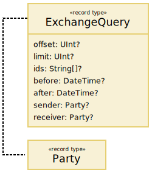

| Field      | Description                                                     |
|:-----------|:----------------------------------------------------------------|
| `offset`   | If given, excludes `offset` items from beginning of result set. |
| `limit`    | If given, limits result set size to `limit` items.              |
| `ids`      | If given, excludes items without an `id` matching any provided. |
| `before`   | If given, includes only items created before provided time.     |
| `after`    | If given, includes only items created after provided time.      |
| `sender`   | If given, limits to items with provided `sender`.               |
| `receiver` | If givem limits to items with provided `receiver`.              |

### 3.3. ExchangeResultSet

The result of some `ExchangeQuery`.

__Truncation__. The receiver of an `ExchangeQuery` is allowed to truncate the set of `items` in its result.
If, however, this is done, it must be reflected in the `limit` field in the `ExchangeResultSet`.

__Offset out of Bounds__. If the `offset` of a `ExchangeQuery` exceeds the number of matching items, the `ExchangeQuery` receiver __must__ reduce the `offset` in the `ExchangeResultSet` to the number of matching items, set `limit` to `0` and provide `items` as an empty array.

| Field      | Description                                                     |
|:-----------|:----------------------------------------------------------------|
| `offset`   | Original or adjusted query offset.                              |
| `limit`    | Original or adjusted query limit.                               |
| `ids`      | Original query `ids`, if given.                                 |
| `before`   | Original query `before`, if given.                              |
| `after`    | Original query `after`, if given.                               |
| `sender`   | Original query `sender`, if given.                              |
| `receiver` | Original query `receiver`, if given.                            |
| `items`    | `Exchange`s matching original `ExchangeQuery`.                  |

### 3.4. Ownership

Specifies what `Party` owns one particular `Token`.

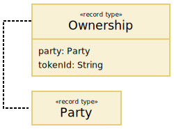

| Field     | Description                                                      |
|:----------|:-----------------------------------------------------------------|
| `party`   | The owner of the `Token` identified by `tokenId`.                |
| `tokenId` | The `id` of a `Token`.                                           |

### 3.5. OwnershipQuery

A query for `Ownership` items.

__Undefined Implies All__. An `OwnershipQuery` is essentially a set of properties that may or may not be specified in order to limit the size of an `OwnershipResultSet`.
Properties that are not specified ought to be understood as if a certain restriction has _not_ been imposed, implying that there should be no reduction in result set size.
If, for example, no `offset` is specified, it must be understood as being `0`, as that is the only way for the property to not reduce the size of a corresponding `OwnershipResultSet`.

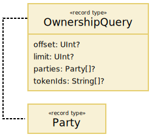

| Field      | Description                                                     |
|:-----------|:----------------------------------------------------------------|
| `offset`   | If given, excludes `offset` items from beginning of result set. |
| `limit`    | If given, limits result set size to `limit` items.              |
| `parties`  | If given, excludes items without a `party` matching any provided.|
| `tokenIds` | If given, excludes items without a `tokenId` matching any provided.|

### 3.6. OwnershipResultSet

The result of some `OwnershipQuery`.

__Truncation__. The receiver of an `OwnershipQuery` is allowed to truncate the set of `items` in its result.
If, however, this is done, it must be reflected in the `limit` field in the `OwnershipResultSet`.

__Offset out of Bounds__. If the `offset` of a `OwnershipQuery` exceeds the number of matching items, the `OwnershipQuery` receiver __must__ reduce the `offset` in the `OwnershipResultSet` to the number of matching items, set `limit` to `0` and provide `items` as an empty array.

| Field      | Description                                                     |
|:-----------|:----------------------------------------------------------------|
| `offset`   | Original or adjusted query offset.                              |
| `limit`    | Original or adjusted query limit.                               |
| `parties`  | Original query `parties`, if given.                             |
| `tokenIds` | Original query `tokenIds`, if given.                            |
| `items`    | `Ownership`s matching original `OwnershipQuery`.                |

### 3.7. Party

Represents the identity of party that can own and exchange `Token`s.

__Valid Key Algorithm Identifiers__. `keyalg` values must consist only of lower-case letters.
If a group qualifier is required, such as when an elliptic curve algorithm is used, the group name follows the algorithm name and a dash.
Examples of valid values are `"dsa"`, `"ecdsa-secp256k1"` and `"rsa"`.

__Standardized Key Algorithm Identifiers__. The algorithm and group names should, if possible, conform to the _TLS SignatureAlgorithm Registry_ and _TLS Supported Groups Registry_ of the _IANA Transport Layer Security (TLS) Parameters_ document (https://www.iana.org/assignments/tls-parameters/tls-parameters.xhtml).
The _Description_ column of each table contains the identifiers to be used.

__Valid Key Lengths__. The byte length of key __must__ be directly supported by the algorithm specified in `keyalg` _without padding_.
If, for example, `keyalg` is `"ecdsa-secp256k1"`, then `key.length` must be `32`, even if a certain amount of leading or trailing bytes would be `0`.
If `keyalg` would be `"rsa"`, then any valid RSA length is allowed (e.g., `128`, `256`, or `512`).

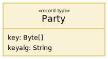

| Field    | Description                                                       |
|:---------|:------------------------------------------------------------------|
| `key`    | Unencoded public key identifying a party.                         |
| `keyalg` | Signature algoritm used to generate `key`.                        |

### 3.8. PartySet

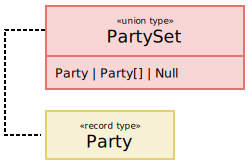

| Field              | Description                                             |
|:-------------------|:--------------------------------------------------------|
| | |
| | |

### 3.9. Proposal

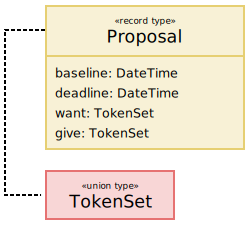

| Field              | Description                                             |
|:-------------------|:--------------------------------------------------------|
| | |
| | |

### 3.10. ProposalVisibility

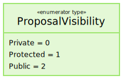

| Field              | Description                                             |
|:-------------------|:--------------------------------------------------------|
| | |
| | |

### 3.11. Token

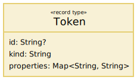

| Field              | Description                                             |
|:-------------------|:--------------------------------------------------------|
| | |
| | |

### 3.12. TokenQuery

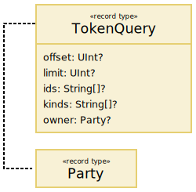

| Field              | Description                                             |
|:-------------------|:--------------------------------------------------------|
| `offset`           | Number of items to exclude, from beginning of result set. |
| `limit`            | The maximum number of items to include in result set.   |

### 3.13. TokenResultSet

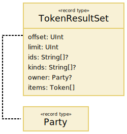

| Field              | Description                                             |
|:-------------------|:--------------------------------------------------------|
| | |
| | |

### 3.14. TokenSet

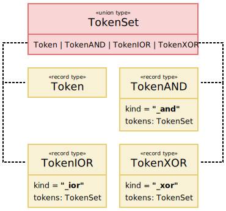

| Field              | Description                                             |
|:-------------------|:--------------------------------------------------------|
| | |
| | |

## References