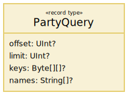
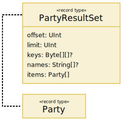

# The Arrowhead Broker – Service Description

## Abstract

This document describes the abstract services exposed by the Arrowhead Broker System.

## 1. Overview

The `Broker` system facilitates token ownership negotitation and accounting.
It acts as a trusted intermediary, allowing its consumers to exchange tokens via an arbitrary _trading platform_.

### 1.1. Brokering Sessions

Whenever a properly authorized Arrowhead system consumes the `Brokering` service produced by a `Broker` system, a persistent session is created or resumed for the consuming system.
Each session is associated with the authenticated identity of its owner, provided via a certificate or otherwise.

#### 1.1.1. Identities

All brokering sessions contain a _trading platform identity_, which is the identity used to represent the session owner while exchanging tokens. The trading platform identity can be queried via the `BrokerAccounting` service `getAgentId` function, and corresponds to the `key` field of the `Party` data type. The identity is primarily of use to consuming systems for telling their own activity apart from any other data acquired via the `BrokerAccounting` service.

#### 1.1.2. On-Going Token Exchanges

Each session holds all state concerning on-going token exchanges involving its owner, including information about what state notifications the owner has received.
The `Broker` must try to resend `BrokeringPush` messages being lost due to a session owner being unavailable while any proposal in question remains either acceptable or confirmable.

## 2. Service Interfaces

### 2.1. BrokerAccounting

The `BrokerAccounting` service accounts for past exchange events as well as the identity it uses to represent its consumer.
The services provides no sophisticated analytical capabilities; it serves lists of `Exchange`, `Party` objects in response to coarse-grained queries.
The data served could, however, be used as input to any kind of analysis system.

| Function       | Description
|:---------------|:---
| `getAgentId`   | Gets _trading platform identity_ used to represent function caller.
| `getExchanges` | Queries for `Exchange` objects, representing finalized `Token` exchanges.
| `getParties`   | Queries for `Party` objects, representing known parties that can or have exchanged `Token`s.

### 2.2. Brokering

The `Brokering` service is used by consuming systems to _send_ messages for creating or updating _Exchange State Machines_ (ESMs).
The service is always used together with the `BrokeringPush` service, which is used for _receiving_ ESM updates made by any exchange counter-parties.

| Function  | Description
|:----------|:---
| `propose` | Proposes a `Token` exchange to some set of receivers. Returns a `Proposal` identifier only if given `proposal` is qualified.
| `accept`  | Accepts an identified `Proposal`, making it pending confirmation. If the accepted `Proposal` does not exist, or if its deadline has expired, the call fails.
| `reject`  | Rejects an identified `Proposal`. If the rejected `Proposal` does not exist, the call fails.
| `confirm` | Confirms an accepted `Proposal`, making it binding. Unless the confirmed `Proposal` exists and is accepted, the call fails.
| `abort`   | Aborts accepted exchange `Proposal`. Unless the aborted `Proposal` exists and is accepted, the call fails.

### 2.3. BrokeringPush

Each system consuming the `Brokering` service must also expose a `BrokeringPush` service in order to receive exchange proposals and updates.
If, however, the corresponding `Brokering` implementation exposes its functions through a chat-like protocol, such as XMPP or JSON-RPC, then this service exists only implicitly.
In that case, the same communication channel established by the `Brokering` consumer is used by the `Brokering` service to send the `BrokeringPush` messages.

| Function  | Description
|:----------|:---
| `propose` | Called to notify about an incoming `Token` exchange `Proposal`. A `Proposal` identifier is only provided if provided `proposal` is qualified.
| `accept`  | Called to notify about a previously sent `Proposal` being accepted.
| `reject`  | Called to notify about a previously sent `Proposal` being rejected.
| `confirm` | Called to notify about a previously accepted `Proposal` being confirmed.
| `abort`   | Called to notify about a previously accepted `Proposal` being aborted.

## 3. Information Model

### 3.1. Exchange

Describes a completed `Token` exchange, where a proposer gave up ownership of some tokens in `proposal.give` in exchange for the tokens in `proposal.want`.

| Field         | Description
|:--------------|:---
| `id`          | String uniquely identifying `Exchange`.
| `completedAt` | The date and time at which `Exchange` was finalized.
| `proposal`    | The accepted and confirmed exchange `Proposal`.
| `proposerKey` | Identity of `Party` that proposed and confirmed `proposal`.
| `acceptorKey` | Identity of `Party` that accepted `proposal`.

### 3.2. ExchangeQuery

A query for `Exchange` items.

__Undefined implies all__.
An `ExchangeQuery` is essentially a set of properties that may or may not be specified in order to limit the size of an `ExchangeResultSet`.
Properties that are not specified ought to be understood as if a certain restriction has _not_ been imposed, implying that there should be no reduction in result set size.
If, for example, no `offset` is specified, it must be understood as being `0`, as that is the only way for the property to not reduce the size of a corresponding `ExchangeResultSet`.

| Field          | Description
|:---------------|:---
| `offset`       | If given, excludes `offset` items from beginning of result set.
| `limit`        | If given, limits result set size to `limit` items.
| `ids`          | If given, includes only items with an `id` matching any provided.
| `before`       | If given, includes only items created before provided time.
| `after`        | If given, includes only items created after provided time.
| `proposerKeys` | If given, includes only items with a `proposerKey` matching any provided.
| `acceptorKeys` | If given, includes onlu items with an `acceptorKey` matching any provided.

### 3.3. ExchangeResultSet

The result of some `ExchangeQuery`.

__Truncation__.
The receiver of an `ExchangeQuery` is allowed to truncate the set of `items` in its result.
If, however, this is done, it must be reflected in the `limit` field in the `ExchangeResultSet`.

__Offset out of bounds__.
If the `offset` of an `ExchangeQuery` exceeds the number of matching items, the `ExchangeQuery` receiver __must__ reduce the `offset` in the `ExchangeResultSet` to the number of matching items, set `limit` to `0` and provide `items` as an empty array.

| Field          | Description
|:---------------|:---
| `offset`       | Original or adjusted query offset.
| `limit`        | Original or adjusted query limit.
| `ids`          | Original query `ids`, if any.
| `before`       | Original query `before`, if any.
| `after`        | Original query `after`, if any.
| `proposerKeys` | Original query `proposerKeys`, if any.
| `acceptorKeys` | Original query `acceptorKeys`, if any.
| `items`        | `Exchange`s matching original `ExchangeQuery`.

### 3.4. Party

Represents the identity of a party that can own and exchange `Token`s.

__Party identifiers__.
Party identifiers are only guaranteed to be valid for communication with a particular Broker system.
There may, however, be ways to have this guarantee extended to include more system instances, such as by having multiple Brokers share state by using the same database cluster.

| Field        | Description
|:-------------|:---
| `id`         | Unique `Party` string identifier.
| `name`       | Common name of `Party`.
| `attributes` | Any other `Party` attributes.

### 3.5. PartyQuery

A query for `Party` items.

__Undefined implies all__.
An `PartyQuery` is essentially a set of properties that may or may not be specified in order to limit the size of an `PartyResultSet`.
Properties that are not specified ought to be understood as if a certain restriction has _not_ been imposed, implying that there should be no reduction in result set size.
If, for example, no `offset` is specified, it must be understood as being `0`, as that is the only way for the property to not reduce the size of a corresponding `PartyResultSet`.

| Field    | Description
|:---------|:---
| `offset` | If given, excludes `offset` items from beginning of result set.
| `limit`  | If given, limits result set size to `limit` items.
| `keys`   | If given, includes only items with a `key` matching any provided.
| `names`  | If given, includes only items with a `name` matching any provided.

### 3.6. PartyResultSet

The result of some `PartyQuery`.

__Truncation__.
The receiver of an `PartyQuery` is allowed to truncate the set of `items` in its result.
If, however, this is done, it must be reflected in the `limit` field in the `PartyResultSet`.

__Offset out of bounds__.
If the `offset` of a `PartyQuery` exceeds the number of matching items, the `PartyQuery` receiver __must__ reduce the `offset` in the `PartyResultSet` to the number of matching items, set `limit` to `0` and provide `items` as an empty array.

| Field    | Description
|:---------|:---
| `offset` | Original or adjusted query offset.
| `limit`  | Original or adjusted query limit.
| `keys`   | Original query `keys`, if any.
| `names`  | Original query `names`, if any.
| `items`  | `Party` items matching original `PartyQuery`.

### 3.7. Proposal

A `Token` exchange proposal.

__Proposal qualification__.
A `Proposal` can be either _qualified_ or _unqualified_, depending on whether it includes any sources of ambiguity.
Concretely, a `Proposal` is qualified if its `want` and `give` properties are qualified.

| Field        | Description
|:-------------|:---
| `baseline`   | The moment in time when this `Proposal` becomes acceptable.
| `deadline`   | The moment in time when this `Proposal` ceases to be acceptable.
| `want`       | A description of what tokens are desired.
| `give`       | A description of what tokens are offered in return for the desired such.

### 3.8. Token

A representation of an ownable material or immaterial entity.

__Identifiers must be unique__.
Relevant `Token` `id`s could contain everything from simple names to serial numbers.
However, an `id` must, without being combined with a `kind`, be able to uniquely identify a single ownable entity.

| Field        | Description
|:-------------|:---
| `id`         | A string uniquely idenitifying a particular entity, if given.
| `kind`       | A string identifying the general category of this entity. Must not be any of `"_and"`, `"_ior"` or `"_xor"`.
| `properties` | A set of properties distinguishing this entity from other of the same `kind`.

### 3.9. TokenSet

A logical set of `Token`s.

__Logical sets__.
A `TokenSet` is logical in the sense that it can contain alternatives rather than being a regular list of included `Tokens`.
The `TokenSet` type is primarily intended to facilitate the presentation of alternatives when proposing token exchanges, as described in the documentation of the `Brokering` service interface.

| Variant    | Description
|:-----------|:---
| `Token`    | A single `Token`.
| `TokenAND` | A set of alternatives where _all_ `TokenSet`s must be chosen.
| `TokenIOR` | A set of alternatives where _at least one_ `TokenSet` must be chosen.
| `TokenXOR` | A set of alternatives where _exactly one_ `TokenSet` must be chosen.

## References